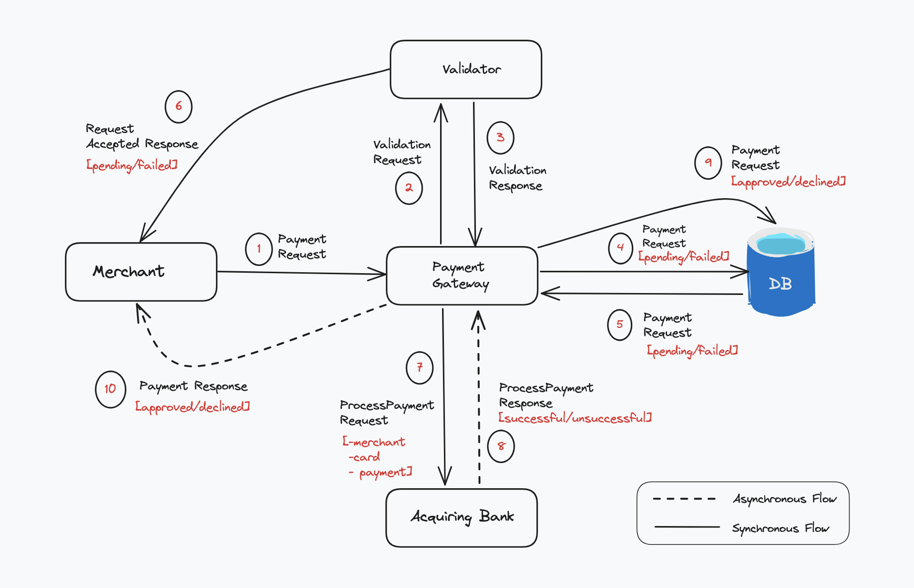

# Report

This report consist of the following:
- Understanding the requirements & Deliverables
- Scope & Assumptions
- Designing the Solution
    - Entities
    - DFD Diagram
    - API Design
- Creating an execution plan
- Implementation
    - Payment Gateway APIs
    - Acquiring Bank Simulator
    - Bank Simulation App
- Areas of Improvement
- Possible Cloud Technologies & justification

## Understanding the requirements & Deliverables

This project involves the delivery of two(2) systems - A payments Gateway API(depends on an Acquiring bank simulator) and a bank simulator with the following requirements:

1. **A payments Gateway API** - with endpoints for merchants to:
    - **process payments**
        - Validating Request
        - Storing card information and payment details
        - Forwarding the request to the `acquiring bank` for processing
        - Accept processing response from the `acquiring bank`
    - **retrieve details of a previously made payment**.
        - Retrieving details of a previously made payment(**with senstive card details masked**)

1a. **Acquiring bank simulator** - A simulation of an acquiring bank to process the payment from the payment gateway
    - Send details to processing third-party organization (For this solution, the acquiring bank is required to be simulated to only give a `success` or `unsuccessful` response)

**NB:** In real-life scenarios, the acquiring bank functions also includes:
    - Performing card validation
    - Retrieving cash from shoppers card
    - Pay out to merchant

2. **A bank simulator** - A web app for developers to simulate and explore the APIs.
    - Documentation for the payment APIs
    - Test values for developers perform simulations
    - Simulator to simulate payment APIs and inspect different responses

## Scope & Assumptions

The following assumptions were made in designing the system
- The system has already registered merchants
- The merchants access the system in a secure way so the scope did not cover authn/authz
- The system has only one acquirer for processing payment
- The payment details included minimum details for simplicity
- The Acquirer system gives just a successful/uncessful response to the gateway

## Designing the Solution

The design involved understanding the system entities and their relationships, modeling how data flow through the system and describing the API endpoints to be implemented.

### Entities
- Payment Gateway
- Merchant
- Card
- Payment
- Acquirer

### DFD Diagram

*Online payment data flow diagram*

### API Design

## Creating an execution plan
The plan for execution involved an agile approach as follows:

- Building a completely synchronous system end-to-end with mock data
- Implementing asynchronous features in the system with dummy data
- Connecting to a real database

As the database is a detail, this plan ensured that I focused on the core functionalities before introducing the database. Each stage of the implementation involved documentation update, code refactoring, error handling and testing to ensure the quality and functionality of the system.

## Implementation

### Payment Gateway APIs
This was implemented with express.js using the MVC architecture to split the system into routes, controllers, handlers, models and services in order to achieve more modularity which is key for unit testing.

- Project setup - Setting up the project, logging(morgan), documentation(swagger) and development dependencies (eslint, prettier, typescript)
- Set up middlewares and implement routes
- Implemented error handling
- Dockerize the API service

### Acquiring Bank Simulator
This was implemented as a function with a mode flag to configure a predetermined response from the acquiring bank.

### Bank Simulation App
This was implemented using a component-based framework(React) in order to leverage on the reusable components for a modular design. The steps involved:

- Project setup - Setting up the project with Vite and development dependencies (eslint, prettier, typescript)
- Implementing the Simulator end-to-end as wireframe
- Implemented styles with CSS
- Implementing error handling and validation
- Dockerize the app

## Next steps & Areas of Improvement
- Implementing the asynchronous features of the system
- Refactoring simulator app to extract reusable components and modularize the app
- Integrating with a database 
- Testing - unit, integration, E2E
- Retries on failure
- Smart rerouting in case of multiple acquirers
- Queues for resilience

## Possible Cloud Technologies & justification

### Short Term

In the short term, I will recommend the following Cloud service the the Payment Gateway
- Elastic Beanstalk
- Elastic Container Registry(ECR)
- DynamoDB
- Amazon API Gateway

At this point, the project scale is relatively small so a simple docker instance on the `Elastic Beanstalk` PaaS will be sufficient to deploy the APIs and simulator as containers using the `Elastic Container Registry(ECR)` as the image registry. This containerized deployment will enable for scaling in the future. In addition, the `DynamoDB` gives some flexibility on the data as the database can be switched without affecting the implementation. Also, the replication of data in DynamoDB provides some risk mitigation benefits which is needed in the finance sector. Finally, the `API gateway` provides an efficient way to manage the API endpoints as well as serving as a reverse proxy and a central point for implementing security checks, logging, request validation, etc.

### Long Term

As the solution evolve, there will be need for scaling, automation, performance and resilience in the system. So, the recommendation to deploy the solution as containers will pay off as it will be easier to introduce the following:

- Elastic K8s Service
- App Runner
- Elastic Load Balancing
- Elastic Queue

The `Elastic K8s Service` and a managed docker platform(`App Runner`) will be needed to manage the large numbers of container clusters which may not be efficient to run self-manged docker instances. In addition, the ensure high performance and effective utilisation of the increasing resources we will need the `Elastic Load Balancing` to evenly distribute request across available instances of the solution. Also, the queue will be needed to keep up with the high volumes of transactions as as the plaform scales.